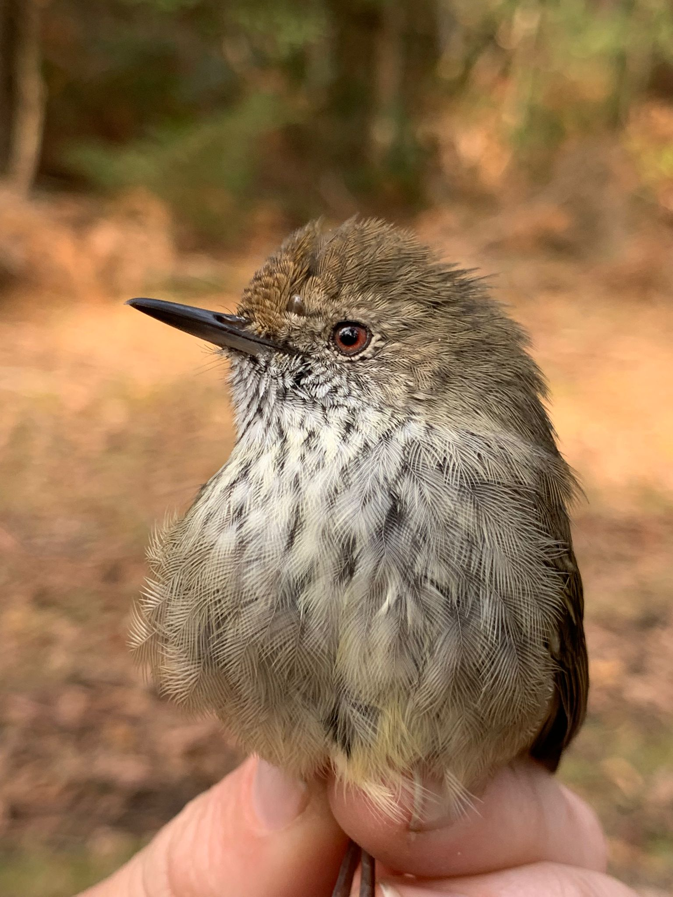
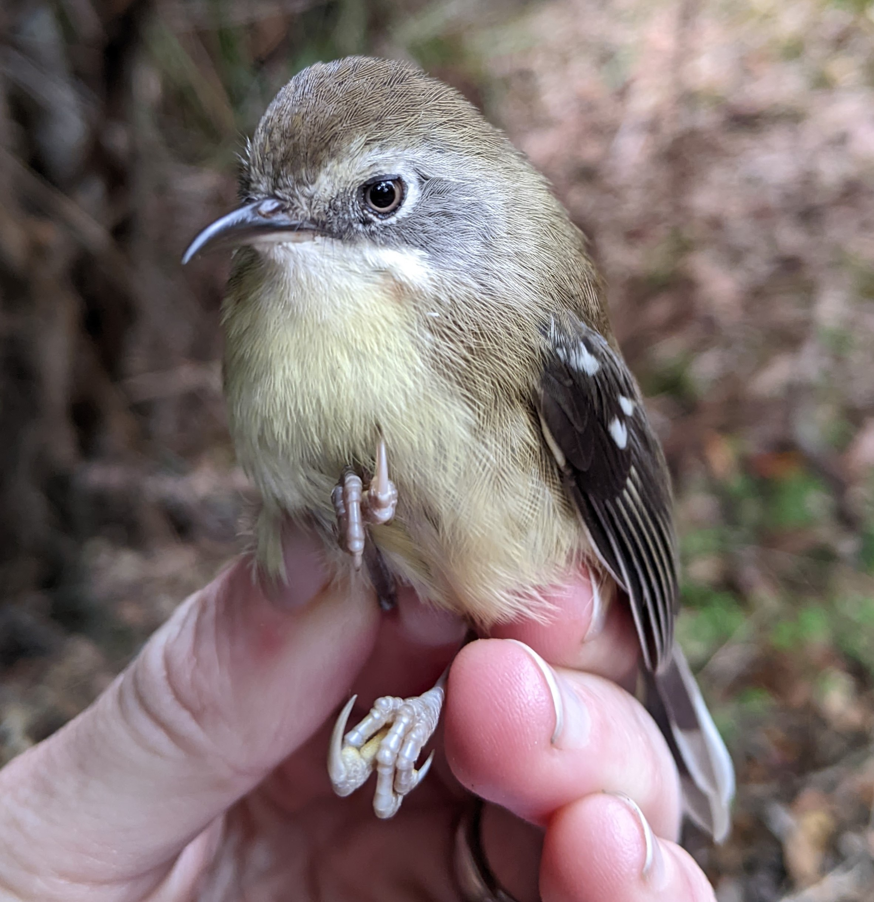
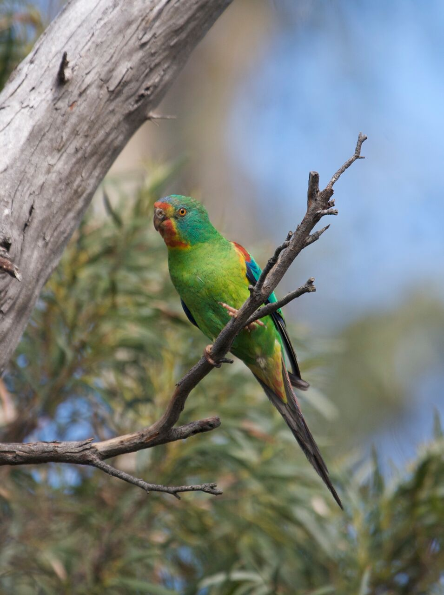
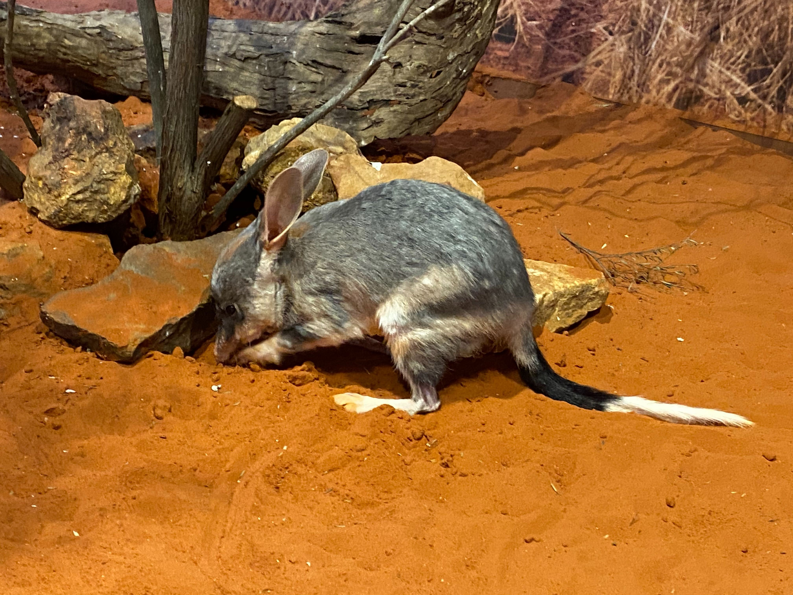
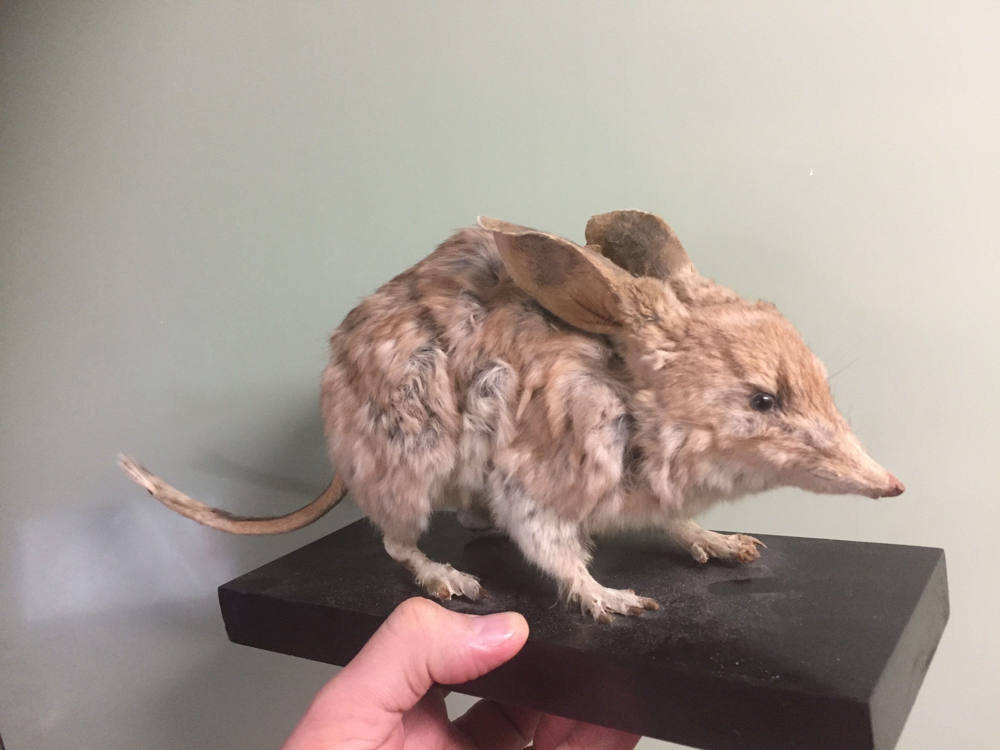
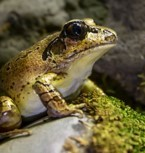
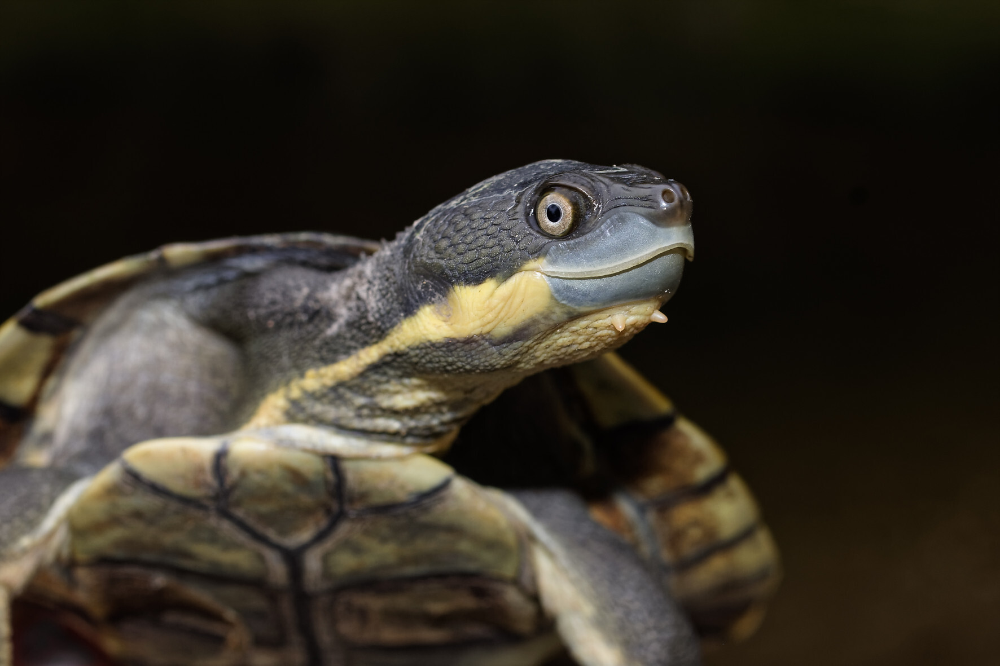
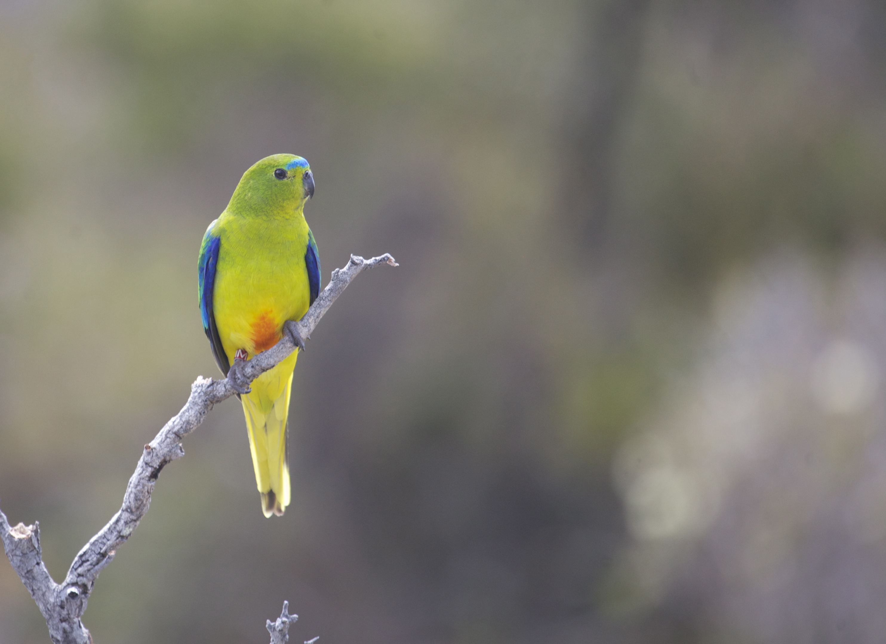

[Home Page](index.md)

Data is sorted into folders by species name, inside each folder are the links to the currently available data for the species' genomes, transcriptomes, annotated immune genes and re-sequenced genomes.</font>

*Genome naming convention*
```
taxa(first three letters)_Genus(first three letters)_Species_primary/seconday_version number_NCBI submission date
```

*Transcriptome naming convention*
```
taxa(first three letters)_Genus(first three letters)_Species_tissue type_version number_NCBI submission date
```

  [*Acanthiza pusilla* (Brown thornbill)](./species/Acanthiza_pusilla.md) Image courtesy of Ross Crates

  [*Acanthornis magna magna* (Tasmanian scrubtit)](./species/Acanthornis_magna_greeniana.md) Image courtesy of Catherine Young

  [*Anthochaera phrygia* (Regent honeyeater)](./species/Anthochaera_phrygia.md)

  [*Bettongia penicillata ogilbyi* (Woylie)](./species/Bettongia_penicillata_ogilbyi.md)
Image courtesy of Sabrina Trocini

  [*Carcharias taurus* (Grey nurse shark)](./species/Carcharias_taurus.md)

  [*Cryptoblepharus egeriae* (Christmas Island blue-tailed skink)](./species/Cryptoblepharus_egeriae.md) Image courtesy of Lisa Cavanagh

  [*Lathamus discolor* (Swift parrot)](./species/Lathamus_discolor.md) Image courtesy of Dejan Stojanovic

  [*Lepidodactylus listeri* (Lister's gecko)](./species/Lepidodactylus_listeri.md) Image courtesy of Lisa Cavanagh

  [*Macrotis lagotis* (Ninu: Greater Bilby)](./species/Macrotis_lagotis.md) Image courtesy of Emma Peel

  [*Macrotis leucura* (Yallara: Lesser Bilby)](./species/Macrotis_leucura.md) Image courtesy of Kenny Travouillon

  [*Mixophyes australis* (Southern stuttering frog)](./species/Mixophyes_australis.md) Image courtesy of Zoos Victoria

  [*Myrmecobius fasciatus* (Numbat)](./species/Myrmecobius_fasciatus.md) Image courtesy of Wayne Lawler

  [*Myuchelys georgesi* (Bellinger River snapping turtle)](./species/Myuchelys_georgesi.md) Image courtesy of Shane Ruming

  [*Neophema chrysogaster* (Orange bellied parrot)](./species/Neophema_chrysogaster.md) Image courtesy of Dejan Stojanovic

  [*Phascogale calura* (Red-tailed phascogale)](./species/Phascogale_calura.md) Image courtesy of Brad Leue Photography

  [*Phascolarctos cinereus* (Koala)](./species/Phascolarctos_cinereus.md)

  [*Taudactylus pleione* (Kroombit tinkerfrog)](./species/Taudactylus_pleione.md) Image courtesy of Currumbin Wildlife Sanctuary


