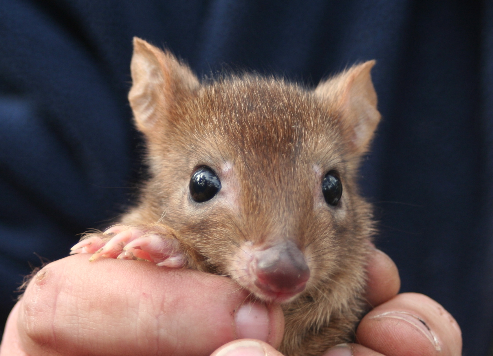
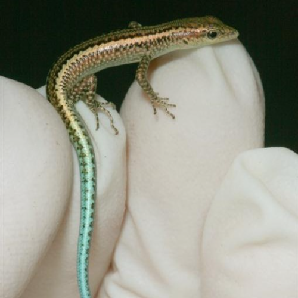
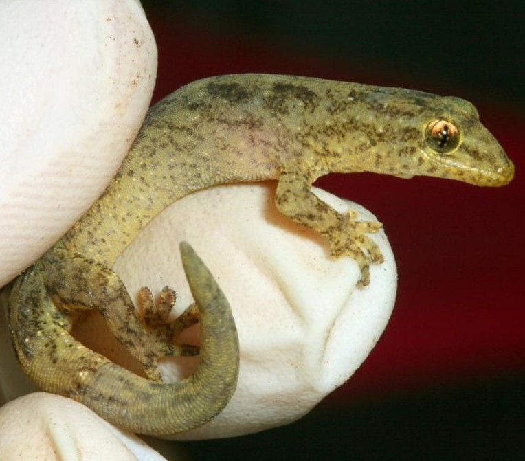
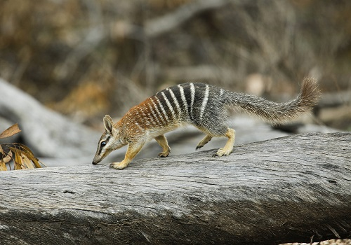
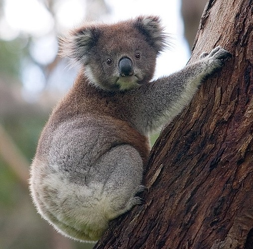
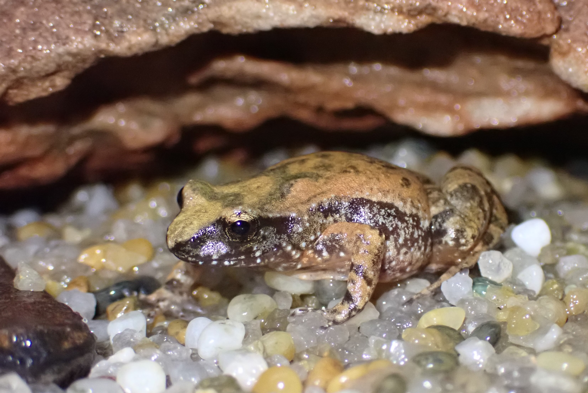

[Home Page](index.md)

Data is sorted into folders by species name, inside each folder are the links to the currently available data for the species' genomes, transcriptomes, annotated immune genes and re-sequenced genomes. 

*Genome naming convention*
```
taxa(first three letters)_Genus(first three letters)_Species_primary/seconday_version number_NCBI submission date
```

*Transcriptome naming convention*
```
taxa(first three letters)_Genus(first three letters)_Species_tissue type_version number_NCBI submission date
```


  [*Bettongia penicillata ogilbyi* (Woylie)](./species/Bettongia_penicillata_ogilbyi.md)

  [*Cryptoblepharus egeriae* (Christmas Island blue-tailed skink)](./species/Cryptoblepharus_egeriae.md)

  [*Lepidodactylus listeri* (Lister's gecko)](./species/Lepidodactylus_listeri.md)

  [*Myrmecobius fasciatus* (Numbat)](./species/Myrmecobius_fasciatus.md)

  [*Phascolarctos cinereus* (Koala)](./species/Phascolarctos_cinereus.md)

  [*Taudactylus pleione* (Kroombit tinkerfrog)](./species/Taudactylus_pleione.md)

  [*Phascogale Calura* (Red-tailed phascogale)](./species/Phascogale_calura.md)
